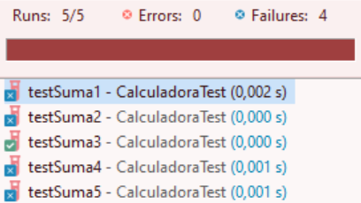
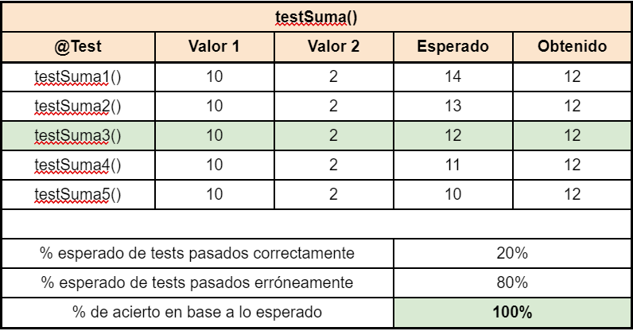
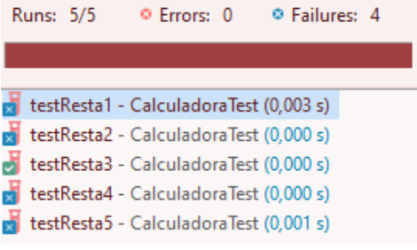
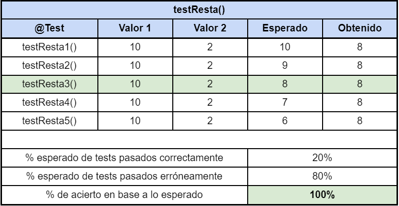
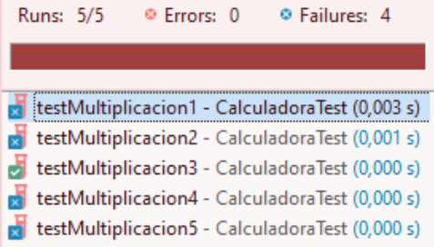
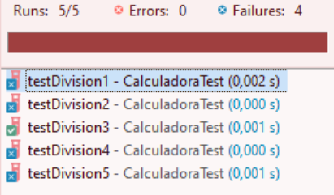
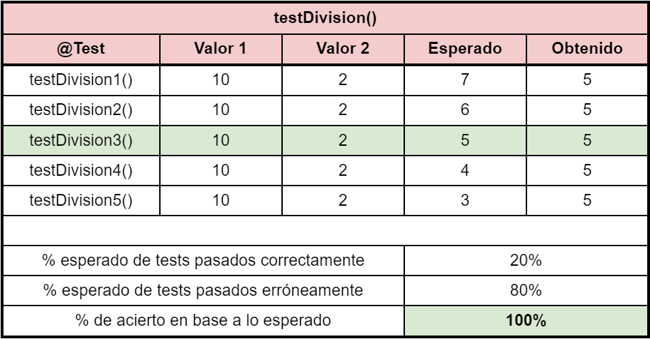
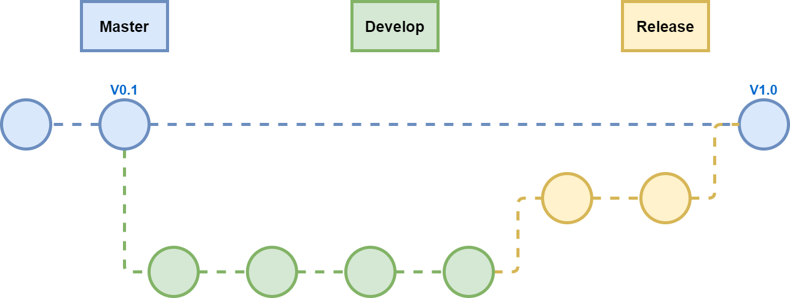

 

***Técnico Superior en Desarrollo de Aplicaciones Multiplataforma***

# ***Practica 5: Test unitario en JUnit***

***Marcos López, Erica Poaquiza***

 

**Profesor:**

*Juan Llado Martorell*

 

***CIFP FRANCESC DE BORJA MOLL***

---

## **Introducción**

En un proyecto de desarrollo de software todos los
códigos deben ser probados. Durante el desarrollo de un programa una de las tareas habituales de los programadores es codificar, compilar y ejecutar las líneas de código que tiene desarrolladas para comprobar su funcionamiento.

Pero esta tarea se puede volver repetitiva y complicada conforme el proyecto se vaya haciendo más grande, por ello en 1997, Erich Gamma y Kent Beck crearon un marco de pruebas unitarias simple pero efectivo para Java llamado JUnit. Así JUnit se convirtió rápidamente en el framework más popular para el desarrollo de pruebas unitarias en Java.

Ahora bien, JUnit no inventó el término prueba unitaria, anteriormente ya se había descrito. El término prueba unitaria hace referencia al proceso de examinar una unidad de trabajo aislada de las otras unidades. Una unidad de trabajo es una tarea que no depende directamente de la realización de ninguna otra tarea. Dentro de una aplicación Java, la unidad de trabajo diferenciada es a menudo, pero no siempre, un solo método. Por el contrario, las pruebas de integración y las pruebas de aceptación examinan cómo interactúan varios componentes.

---

## **JUnit**

JUnit es un framework que actualmente está en su quinta versión. Este se basa en gran medida en anotaciones, un contraste con la idea de extender una clase base para todas las clases de prueba y usar convenciones de nomenclatura para todos los métodos de prueba para que coincida con un patrón.

JUnit provee varias funcionalidades como las anotaciones que proporcionan métodos de inicialización y limpieza de los recursos utilizados durante el test. También contiene una variedad de métodos que verifican los resultados de las pruebas. 

JUnit  esta ya integrado con herramientas populares como Maven, Gradle, así como en IDEs como Eclipse, NetBeans, etc.

### **¿Por qué se deben realizar pruebas en JUnit?**

Las pruebas unitarias puede ser un elemento fundamental en el proceso del un desarrollo exitoso, aquí van varias razones:

- Reduce la probabilidad de defectos.
- Mejora la calidad del código.
- Aumenta el ritmo de desarrollo.
- Aumenta la confianza en el código.

### **Anotaciones en JUnit**

- **@Test**: Marca un método como un método de prueba, dicho método deberá ser público no estático y que no tiene parámetros.

- **@RepeatedTest**: Marca cuántas veces se debe repetir el test.

- **@TestTemplate**: Se utiliza para señalar que el método es una plantilla de prueba.

- **@Before**: Se ejecuta siempre antes de cada método del test. Utilizado para preparar el entorno de prueba.

- **@After**: El método se ejecutará después de cada método del test. Utilizado para limpiar el entorno de pruebas.

- **@BeforeEach**: Marca los métodos que se ejecutarán antes de cualquier método del test.

- **@AfterEach**: Marca métodos que se ejecutarán en cualquier test. Sirve para realizar tareas de limpieza.

- **@TestInstance**: Se usa para configurar el ciclo de vida de las instancias de prueba para la clase de prueba anotada o la interfaz de prueba.

- **@BeforeAll**: Marca el método que se ejecutará una única vez antes que cualquier método de prueba. Los métodos marcados con @BeforeAll deberán ser estáticos.

- **@AfterAll**: Se utiliza para señalar que el método anotado debe ejecutarse después de todas las pruebas en la clase de prueba actual.

- **@Disabled**: Se utiliza para señalar que la clase de prueba anotada o el método de prueba está actualmente deshabilitado y no debe ejecutarse.

---

## **Ejercicio**

### 1. [Crear la interfaz ICalculadora con las operaciones sumar, restar, multiplicar y dividir.](https://github.com/Marcos-Lopez-de-la-Fuente/Practica5/blob/main/Calculadora/src/ICalculadora.java)

### 2. [Crear la clase calculadora que utilice la interfaz anterior e implemente los métodos.](https://github.com/Marcos-Lopez-de-la-Fuente/Practica5/blob/main/Calculadora/src/Calculadora.java)

### 3. [Crear los test unitarios en JUnit de estos cuatro métodos.](https://github.com/Marcos-Lopez-de-la-Fuente/Practica5/blob/main/Calculadora/src/CalculadoraTest.java)

---

### 4. Resultados obtenidos en las pruebas unitarias.

Para comprobar el correcto funcionamiento del
código y realizar pruebas unitarias que lo
certifiquen se hará uso de 5 pruebas por
método diferente.

En el caso mostrado únicamente el
“testSuma3()” se ejecuta satisfactoriamente y el
resto no consiguen el resultado esperado, este
resultado certifica el correcto funcionamiento del
método “sumar()”.

 

En el caso mostrado únicamente el “testResta3()” se ejecuta satisfactoriamente y el resto no consiguen el resultado esperado, este resultado certifica el correcto funcionamiento del método “restar()”.

 

En el caso mostrado únicamente el “testMultiplicacion3()” se ejecuta satisfactoriamente y el resto no consiguen el resultado esperado, este resultado certifica el correcto funcionamiento del método “multiplicar()”.

 

En el caso mostrado únicamente el “testDivision3()” se ejecuta satisfactoriamente y el resto no consiguen el resultado esperado, este resultado certifica el correcto funcionamiento del método “dividir()”

---

### **Gitflow**

---

## **Referencias bibliográficas**

Conventional Commits. (n.d.). *Conventional Commits 1.0.0.* Conventional Commits.

&nbsp;&nbsp;&nbsp;&nbsp;&nbsp;&nbsp;&nbsp;&nbsp;&nbsp;&nbsp; Retrieved May 14, 2022, from https://www.conventionalcommits.org/en/v1.0.0/

 

JUnit. (n.d.). *Overview*. JUnit 5. Retrieved May 14, 2022, from

&nbsp;&nbsp;&nbsp;&nbsp;&nbsp;&nbsp;&nbsp;&nbsp;&nbsp;&nbsp; https://junit.org/junit5/docs/current/api/index.html

 

qoomon. (2022, Abril 7). *Conventional Commit Messages · GitHub*. gists · GitHub. Retrieved

&nbsp;&nbsp;&nbsp;&nbsp;&nbsp;&nbsp;&nbsp;&nbsp;&nbsp;&nbsp; May 14, 2022, from

&nbsp;&nbsp;&nbsp;&nbsp;&nbsp;&nbsp;&nbsp;&nbsp;&nbsp;&nbsp; https://gist.github.com/qoomon/5dfcdf8eec66a051ecd85625518cfd13

 

Thomas, D., Hunt, A., & Langr, J. (2015). *Pragmatic Unit Testing in Java 8 with JUnit*.

&nbsp;&nbsp;&nbsp;&nbsp;&nbsp;&nbsp;&nbsp;&nbsp;&nbsp;&nbsp; Pragmatic Bookshelf.

 

Tudose, C. (2020). *JUnit in Action, Third Edition. Manning*.

 

diagrams.net. (2020, February 7). *Blog - How to create a gitflow diagram*.  Diagrams.net.

&nbsp;&nbsp;&nbsp;&nbsp;&nbsp;&nbsp;&nbsp;&nbsp;&nbsp;&nbsp; Retrieved May 15, 2022, from https://www.diagrams.net/blog/gitflow-diagram

 

Gliffy. (2021, April 23).*What is a Gitflow Diagram? How to Make a Gitflow Diagram &*

&nbsp;&nbsp;&nbsp;&nbsp;&nbsp;&nbsp;&nbsp;&nbsp;&nbsp;&nbsp; *Visualize Branching Strategies.* Gliffy. Retrieved May 15, 2022, from

&nbsp;&nbsp;&nbsp;&nbsp;&nbsp;&nbsp;&nbsp;&nbsp;&nbsp;&nbsp; https://www.gliffy.com/blog/gitflow-diagrams
